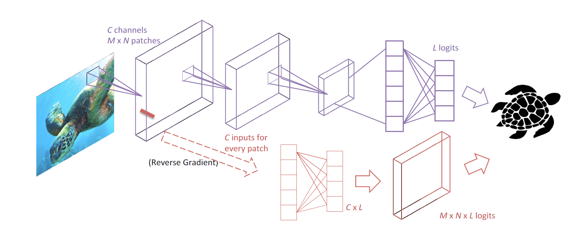
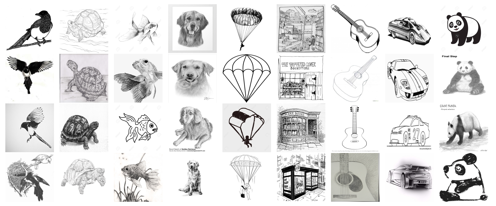

# Learning Robust Global Representations by Penalizing  Local Predictive Power
Anonymous Author(s)\*

## Requirements
- Python 3.6 with Numpy and opencv-python
- [Tensorflow](https://www.tensorflow.org/) tested on version `1.10.0`

## Patch-wise Adversarial Regularization (PAR)

We introduced the patch-wise adversarial regularization (PAR) that regularizes the model to focus on global concept of the depicted objects in training data by penalizing the model’s predictive power through local patches. To attest the effectiveness of our model, we verify it on a variety of domain adaptation/generalization settings, including perturbed [MNIST](http://yann.lecun.com/exdb/mnist/), perturbed [CIFAR10](https://www.cs.toronto.edu/~kriz/cifar.html), [PACS](http://www.eecs.qmul.ac.uk/~dl307/project_iccv2017) and a novel large-scale domain generalization dataset ImageNet-Sketch. Please refer to each experiment folder for codes to reproduce the benchmark mentioned in our paper.

## ImageNet-Sketch Dataset

Compatible with standard ImageNet validation data set for the classification task, we introduce ImageNet-Sketch dataset which consists of 50000 images, 50 images for each of the 1000 ImageNet classes. We construct the data set with Google Image queries “sketch of ”, where is the standard class name. We only search within the “black and white” color scheme. We initially query 100 images for every class, and then manually clean the pulled images by deleting the irrelevant images and images that are for similar but different classes. For some classes, there are less than 50 images after manually cleaning, then we augment the data set by flipping and rotating the images.
